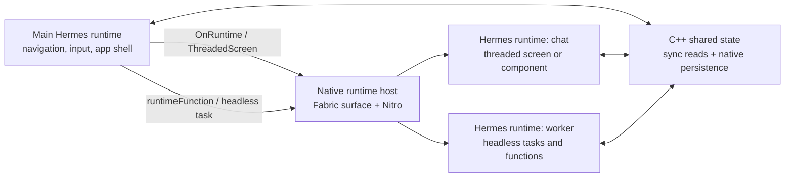

# Contributing to react-native-runtimes

Thank you for your interest in contributing! This guide covers the project architecture and how to run the example app locally.

---

## Architecture



Secondary runtimes can host React Native surfaces, execute typed functions, run headless jobs, and coordinate through native shared state while staying isolated from the main JS heap.

---

## Running the Example App

```sh
npm install
npm run android
# or
npm run ios
```

Release smoke-test build:

```sh
cd android
./gradlew :app:assembleRelease
adb install -r app/build/outputs/apk/release/app-release.apk
```
