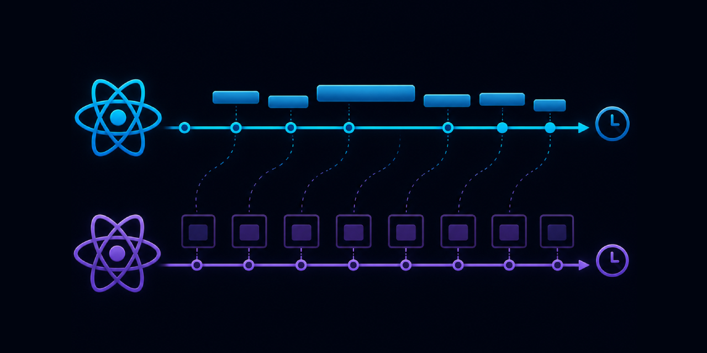

<div align="center">



# react-native-runtimes

**Run heavy React Native UI and business logic in isolated Hermes runtimes — without freezing your main JS thread**

[](https://reactnative.dev)
[](https://reactnative.dev/docs/the-new-architecture/landing-page)
[](https://expo.dev)
[](https://developer.android.com)
[](https://developer.apple.com)
[](LICENSE)

[📖 Docs](https://szymon20000.github.io/react-native-runtimes/) · [⚡ Quick Start](#getting-started) · [📦 Core](packages/core/README.md) · [🗂 State](packages/state/README.md)

</div>

---

## What is this?

React Native gives your product one main JavaScript runtime. When a feed, chat screen, editor, reducer, or hydration job monopolizes that runtime, input, animation, and navigation all start competing for the same VM.

**react-native-runtimes** adds a multi-runtime layer for React Native New Architecture apps:

- mount selected React components in named secondary Hermes runtimes
- run whole screens, headless tasks, and typed functions away from the main runtime
- share state across isolated JS heaps through a native C++ singleton
- prewarm runtimes before navigation so expensive surfaces are ready when users arrive
- wire it through Metro and, for Expo, a config plugin instead of hand-written runtime plumbing

```tsx
// That's it. This component now renders in its own Hermes instance.
<OnRuntime name="chat-runtime">
  <MessageList conversationId={conversationId} />
</OnRuntime>
```

---

## What it unlocks

| If your app has... | You can move... | Main runtime keeps... |
|---|---|
| A chat, feed, or inbox that janks on mount | The expensive list or route surface | Navigation, gestures, and input |
| Reducers or stores competing with animation | Business logic in a long-lived runtime | Frame-critical UI work |
| Slow first-open screens | A prewarmed runtime before the user taps | Predictable navigation latency |
| Background hydration or decoding | Headless tasks on a worker runtime | Responsive startup and render |
| State that must be visible everywhere | Native-backed shared stores | Synchronous reads without bridge round-trips |

---

## When to reach for it

- You have one or two expensive features that repeatedly monopolize the main JS runtime.
- You want a chat, feed, editor, map sidebar, or media-heavy route to stay alive and warm.
- You need business logic or cache hydration to run without blocking interaction.
- You are already on React Native New Architecture with Hermes, or you are willing to move there.

## When not to use it

- Your app is simple enough that memoization, virtualization, or moving work off render fixes the issue.
- You need legacy architecture or a non-Hermes JS engine.
- You want to pass large mutable objects or non-serializable props directly between runtimes. Pass ids/keys and read shared data from native-backed state instead.

---

## Packages

| Package | Description |
|---|---|
| [`@react-native-runtimes/core`](packages/core/README.md) | Mount React components in secondary runtimes. Metro transform, `OnRuntime`, `ThreadedScreen`, headless tasks, cross-runtime function calls. |
| [`@react-native-runtimes/state`](packages/state/README.md) | Zustand-style shared store backed by a process-wide C++ singleton. Synchronous reads and commits from every runtime. |

---

## Core capabilities

### 🧵 Zero-boilerplate threaded components

Wrap a component in `OnRuntime` — Metro rewrites the JSX to a registered threaded boundary at build time. No manual registration required.

```tsx
import { OnRuntime } from '@react-native-runtimes/core';

<OnRuntime name="feed-runtime">
  <HeavyFeedList userId={userId} />
</OnRuntime>
```

### 📱 Full-screen threaded routes

For navigation flows that should live entirely on a secondary runtime:

```tsx
import { ThreadedScreen, threadedComponent } from '@react-native-runtimes/core';

export const ConversationScreen = threadedComponent<Props>(
  'ConversationScreen',
  (props) => <ConversationRoute {...props} />,
);

// In your navigator:
<ThreadedScreen
  component={ConversationScreen}
  props={{ conversationId }}
  runtimeName={`chat-${conversationId}`}
/>
```

### ⚡ Runtime prewarming

Start the runtime before the user navigates so there is no cold-start lag:

```tsx
import { ThreadedRuntime } from '@react-native-runtimes/core';

// e.g. when the inbox row becomes visible
await ThreadedRuntime.prewarm(`chat-${conversationId}`);
```

### 🏃 Headless tasks

Run JS on a named runtime without mounting a view — perfect for pre-hydrating stores, decoding data, or running reducers in a long-lived worker:

```tsx
// Register on the threaded bundle side:
registerThreadedHeadlessTask('hydrateConversation', async ({ payload }) => {
  const messages = await loadMessages(payload.conversationId, payload.limit);
  await messagesStore.setSubtreeState(payload.conversationId, messages, true);
});

// Dispatch from anywhere:
await ThreadedRuntime.runHeadlessTask('hydrateConversation', {
  runtimeName: 'chat-worker-runtime',
  payload: { conversationId, limit: 50 },
});
```

### 🔀 Cross-runtime function calls

Call a typed function on a specific runtime and await the result — arguments and return values are JSON-serialized automatically:

```tsx
import { call, runtimeFunction } from '@react-native-runtimes/core';

export const fibonacci = runtimeFunction((n: number) => ({
  input: n,
  result: fibonacciNumber(n),
  computedAt: new Date().toISOString(),
}));

// Call it on a named runtime from the main runtime:
const result = await call(fibonacci).on('fibonacci-worker-runtime')(38);
```

Or use a function directive for fixed-runtime helpers — Metro rewrites the call site automatically:

```tsx
async function refreshCache(key: string) {
  'background'; // ← directive: this function always runs on 'background' runtime
  await cacheStore.hydrate();
  return cacheStore.get(key);
}

const value = await refreshCache('settings'); // cross-runtime, no extra API
```

### 🗂 Shared state — synchronous, cross-heap

A Zustand-style API backed by a native C++ process-wide singleton. Reads are synchronous. No bridge round-trip. Any runtime can write and every subscriber is notified.

```tsx
import { createSharedStore } from '@react-native-runtimes/state';

export const chatStore = createSharedStore({
  name: 'chat',
  initialState: { messages: {}, settings: { theme: 'dark' } },
});

// Path handles for fine-grained subscriptions:
const roomMessages = chatStore.path<Message[]>(['messages', 'release-room']);

await roomMessages.update(items => [...(items ?? []), newMessage]);

// Subscribe with a selector — works in any runtime:
const count = roomMessages.use(items => items?.length ?? 0);
```

Add native persistence with a single option:

```tsx
export const preferencesStore = createSharedStore({
  name: 'preferences',
  initialState: { counter: { count: 0 } },
  persist: { key: 'preferences', version: 1, subtrees: ['counter'] },
});
```

### 🏗 Business runtimes

For an app-lifetime runtime that sees the same native modules as the main runtime, use `prewarmBusinessRuntime`:

```kotlin
ThreadedRuntime.setMainReactPackagesProvider { PackageList(this).packages }
ThreadedRuntime.prewarmBusinessRuntime(applicationContext, "business-runtime")
```

```tsx
if (global.__THREADED_RUNTIME_ENV__?.kind === 'business-runtime') {
  require('./src/businessRuntimeEntry');
}
```

### 🔌 Expo support

`@react-native-runtimes/core` ships a config plugin. No manual native edits needed:

```ts
// app.config.ts
export default {
  newArchEnabled: true,
  plugins: [
    ['@react-native-runtimes/core', {
      packages: ['@react-native-runtimes/state'],
    }],
  ],
};
```

---

## Getting Started

### 1. Install

```sh
npm install @react-native-runtimes/core @react-native-runtimes/state react-native-nitro-modules
```

### 2. Configure Metro

```js
// metro.config.js
const { getDefaultConfig, mergeConfig } = require('@react-native/metro-config');
const { withThreadedRuntime } = require('@react-native-runtimes/core/metro');

module.exports = withThreadedRuntime(
  mergeConfig(getDefaultConfig(__dirname), {}),
  { roots: ['App.tsx', 'src'], generatedDir: '.threaded-runtime' },
);
```

### 3. Load the generated entry

```js
// index.js
if (global.__THREADED_RUNTIME_ENV__) {
  require('./.threaded-runtime/entry');
} else {
  require('./App');
}
```

### 4. Render

```tsx
import { OnRuntime } from '@react-native-runtimes/core';

export default function App() {
  return (
    <OnRuntime name="my-runtime">
      <HeavyComponent />
    </OnRuntime>
  );
}
```

→ Full setup guide: [packages/core/README.md](packages/core/README.md)

---

## Requirements

| Requirement | Support |
|---|---|
| React Native | **0.76+** |
| Architecture | New Architecture required |
| JavaScript engine | Hermes |
| Platforms | Android and iOS |
| Expo | Config plugin included in `@react-native-runtimes/core` |

---

## Documentation

- 📖 [Hosted docs](https://szymon20000.github.io/react-native-runtimes/)
- 📦 [Core package — full API reference](packages/core/README.md)
- 🗂 [State package — shared store API](packages/state/README.md)
- 🧪 [Example app](example)
- 🏗 [Docusaurus source](website/docs/intro.md)
- 🤝 [Contributing guide](CONTRIBUTING.md)

---

## Authors

<table>
  <tr>
    <td align="center">
      <a href="https://github.com/Szymon20000">
        <br/>
        <sub><b>Szymon Kapała</b></sub>
      </a><br/>
      <a href="https://x.com/Turbo_Szymon">@Turbo_Szymon</a>
    </td>
    <td align="center">
      <a href="https://github.com/v3ron">
        <br/>
        <sub><b>Szymon Chmal</b></sub>
      </a><br/>
      <a href="https://x.com/ChmalSzymon">@ChmalSzymon</a>
    </td>
    <td align="center">
      <a href="https://github.com/pioner92">
        <br/>
        <sub><b>Alex Shumihin</b></sub>
      </a><br/>
      <a href="https://x.com/pioner_dev">@pioner_dev</a>
    </td>
    <td align="center">
      <a href="https://github.com/riteshshukla04">
        <br/>
        <sub><b>Ritesh Shukla</b></sub>
      </a><br/>
      <a href="https://x.com/RiteshRk14">@RiteshRk14</a>
    </td>
  </tr>
</table>

---

<div align="center">

MIT License · Built with ❤️ for the React Native community

</div>
